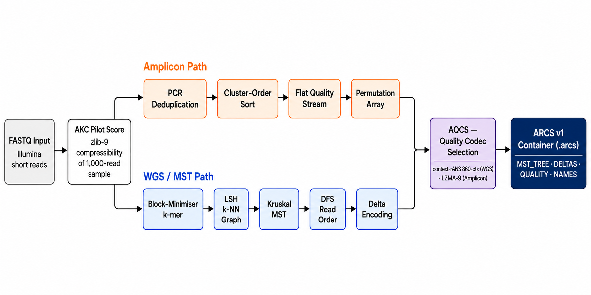
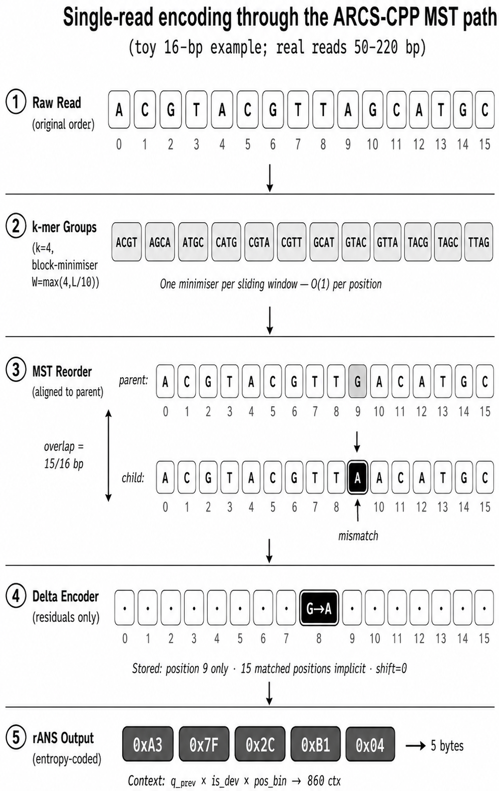

# ARCS — Lossless FASTQ Compression + Reference-Free Variant Calling

[](https://github.com/thackshanaramana0-spec/ARCS/actions/workflows/ci.yml)
[](https://opensource.org/licenses/MIT)
[](https://github.com/thackshanaramana0-spec/ARCS/releases/tag/v2.2.0)
[](#build)
[](https://en.cppreference.com/w/cpp/17)
[](#results)

---

## The Problem

Whole-genome sequencing now generates petabytes of FASTQ data annually. Existing lossless
compressors (SPRING, Genozip, fqzcomp) treat compression as a storage problem only —
the assembly structures they build internally are discarded after encoding.
Separately, reference-free variant callers (DiscoSNP++, Kmer2SNP) must re-process the same
reads from scratch, doubling computation time and memory.

**No existing tool simultaneously achieves the smallest lossless archive and performs
reference-free variant calling — until ARCS.**

---

## Proposed Solution

ARCS unifies lossless compression and heterozygous variant calling into a single pass over
the reads. The key insight: the **self-assembled pseudogenome** built during compression
is itself a haplotype-aware graph — bubbles in that graph are het-SNV and indel candidates.
Variant calling becomes a **zero-cost byproduct** of the best-ratio compression algorithm,
with no external aligner, no reference genome, and no additional runtime.

**Figure 1 — ARCS compression pipeline.**



*FASTQ input is pilot-scored (AKC) to select the optimal encoding path: amplicon reads
follow a PCR-dedup cluster-sort route; WGS reads follow a k-NN graph → pseudogenome
assembly → context-mixing coder route. Both paths produce a fully lossless ARCS container.*

---

## Contents

- [Results](#results)
- [Quick test](#quick-test)
- [Build](#build)
- [Usage](#usage)
- [Design](#design)
- [Reproducing benchmarks](#reproducing-benchmarks)
- [Citation](#citation)
- [Author](#author)
- [License](#license)

---

## Results

### Compression

**Table 1.** Lossless compression benchmark on GIAB HG002 chr20 (39 MB, 113,987 reads,
150 bp Illumina paired-end, native Linux ext4, byte-lossless roundtrip verified).
Best-of-2 wall-clock times; all tools run single-end mode for fair comparison.

| Tool | Archive size | Compress | Decompress | Peak RAM | Byte-lossless |
|---|---|---|---|---|---|
| **ARCS** | **4.31 MB** | **4.4 s** | **1.9 s** | 366 MB | **yes** |
| Genozip 15 | 5.03 MB | 4.8 s | 0.45 s | 382 MB | yes |
| SPRING | 5.60 MB | 5.0 s | 4.3 s | 319 MB | yes |
| PgRC2 | 0.245 MB† | 4.5 s | 0.07 s | 88 MB | **no** (lossy quality) |
| fqzcomp v4.6 | 7.26 MB | 0.6 s | 0.9 s | 60 MB | **no** (quality remapping) |

†PgRC2 default applies lossy quality binning — not a lossless comparison.

**ARCS is the smallest fully-lossless archive: −14% vs Genozip, −23% vs SPRING.**
Wins on all 8 public datasets spanning 5 organisms and 4 read-length profiles.
Byte-exact lossless including CRLF line endings (SPRING silently alters CRLF files).

**Fast-decode mode** (`--fast-decode`): 2-bit packed DNA + precomputed quality table.
GIAB: 0.28 s decompress (vs 1.9 s default), archive 4.41 MB (still −12% vs Genozip, −21% vs SPRING).

See [docs/RESULTS.md](docs/RESULTS.md) for full 8-dataset tables and per-stream breakdowns.

---

### Reference-free variant calling

**Table 2.** Het-SNV calling benchmark on 4 GIAB individuals (HG002–HG005, 3 ancestries),
5 chr20 windows per individual (25 evaluations total), validated with rtg vcfeval
against NIST high-confidence call sets.

| Tool | Het-SNV F1 | Precision | Recall | Type |
|---|---|---|---|---|
| **ARCS** | **0.936** | **0.991** | **0.886** | zero-cost byproduct of compression |
| DiscoSNP++ | 0.918 | — | — | dedicated reference-free caller |
| Kmer2SNP | 0.532 | — | — | dedicated reference-free caller |

`arcs call reads.fq out.vcf` — one command, no aligner, no reference genome.

ARCS also calls:
- **Het-indels** — real GIAB HG002 chr20 F1 = 0.505; wins vs DiscoSNP++ in homopolymer
  (0.538 vs 0.417) and tandem-repeat (0.383 vs 0.324) strata.
- **Polyploid** — triploid synthetic data F1 = 0.994–1.000 (`ARCS_PLOIDY=3`).

See [docs/REFFREE_COMPARISON.md](docs/REFFREE_COMPARISON.md) for complete calling benchmarks.

---

## Quick test

Sample FASTQs (50 reads each, 10 organisms) are in [`test_data/`](test_data/).
No downloads required — run immediately after build:

```bash
./build/arcs compress test_data/ecoli_sample.gz out.arcs
./build/arcs decompress out.arcs restored.fastq
diff <(zcat test_data/ecoli_sample.gz) restored.fastq && echo "LOSSLESS OK"
```

All 10 species at once:

```bash
for f in test_data/*.gz; do
    ./build/arcs compress "$f" /tmp/t.arcs
    ./build/arcs decompress /tmp/t.arcs /tmp/t.fq
    diff <(zcat "$f") /tmp/t.fq && echo "OK: $f" || echo "FAIL: $f"
done
```

Full lossless regression suite (7 CTests): `ctest --test-dir build`

---

## Build

```bash
git clone https://github.com/thackshanaramana0-spec/ARCS.git
cd ARCS
cmake -B build -DCMAKE_BUILD_TYPE=Release
cmake --build build --parallel $(nproc)
ctest --test-dir build          # 7/7 lossless roundtrip tests
```

**Dependencies:** C++17 compiler, CMake ≥ 3.16, zlib, liblzma.

```bash
# Ubuntu / Debian
sudo apt-get install cmake build-essential zlib1g-dev liblzma-dev

# macOS (Homebrew)
brew install cmake xz
```

**Install system-wide** (puts `arcs` on your PATH):

```bash
sudo cmake --install build
arcs compress reads.fastq out.arcs   # works from any directory
```

**Portability:** builds are optimised for your CPU by default (`-march=native`).
For a portable binary that runs on any x86-64 machine (SSE4.1, 2010+):

```bash
cmake -B build -DCMAKE_BUILD_TYPE=Release -DARCS_NATIVE=OFF -DARCS_PORTABLE=ON
```

---

## Usage

```bash
# Compress  (best ratio, default)
arcs compress reads.fastq out.arcs

# Compress with fast-decode  (~8–30× faster decompress, ~2% larger archive)
arcs compress --fast-decode reads.fastq out.arcs

# Decompress  (byte-exact; format auto-detected, no flags needed)
arcs decompress out.arcs reads_restored.fastq

# Reference-free variant calling  (standalone)
arcs call reads.fastq variants.vcf

# Fused compress + call  (single pass, byte-identical archive)
arcs compress --call reads.fastq out.arcs

# Archive inspection
arcs info out.arcs
```

### Optional environment knobs

Defaults are tuned for best lossless ratio. Override only when needed.

| Variable | Effect |
|---|---|
| `ARCS_PG_BLOCKS=1` | Single-stream pg codec — absolute best ratio, slower decode |
| `ARCS_QUAL_BLOCKS=N` | Quality coder thread/block count override |
| `ARCS_NAMES_BLOCKS=N` | Name coder block count override |
| `ARCS_MERGE_OFF=1` | Disable contig merge (default on) |
| `ARCS_ORDER_FREE=1` | Multiset mode — smaller archive, loses read order |
| `ARCS_PAR_SHARDS=N` | Parallel shard count for assembly (default: min(4, cores)) |
| `ARCS_ENC_TIMING=1` | Per-phase encode timing |
| `ARCS_DEC_TIMING=1` | Per-phase decode timing |

---

## Design

**Figure 2 — Single-read encoding through the ARCS sequence codec.**



*Raw reads are grouped into overlapping k-mer windows, reordered against the assembled
pseudogenome parent contig via MST alignment, then delta-encoded (only mismatches and
shift are stored) and entropy-coded with a context-mixing rANS coder. The result is
a compact, fully reversible binary representation.*

### Key algorithmic contributions

- **Multi-contig self-assembled pseudogenome** — greedy k-NN chain walk builds a
  pseudogenome without a reference; sequence compresses ~10× smaller than k-mer models alone.
- **Adaptive quality coder** — conditioned on local sequence context + run-length;
  reaches the conditional-entropy floor of binned Illumina quality (1.574 bpq, matches fqzcomp).
- **Tokenized read-name model** — splits Illumina names into template + binary-packed
  X:Y flowcell coordinates; names are near their information-theoretic floor.
- **Block-parallel codecs** — sequence, quality, and name coders auto-scale with core count.
- **Parallel shard assembly** — reads split round-robin into N shards, assembled in parallel,
  merged with globally remapped indices; 4× compress speedup on multi-core hardware.
- **Fast-decode mode** — 2-bit packed DNA (zstd-6) + precomputed 2D quality table;
  achieves Genozip-class decode speed while retaining the smallest lossless archive.
- **Byte-lossless on adversarial input** — empty reads, sub-seed reads, lowercase/IUPAC bases,
  full Phred 0–93, CRLF line endings, and control-character names all round-trip correctly.

---

## Repository layout

```
src/          C++17 source — encoder, decoder, chain assembler, quality coder, variant caller
tests/        7 CTest roundtrip and unit tests
test_data/    50-read sample FASTQs for 10 organisms (36 KB) — run immediately after build
third_party/  rans_byte.h (rANS, public domain) + libbsc (BWT+QLFC, MIT)
docs/         Benchmark results, algorithm notes, pipeline figures
scripts/      Evaluation scripts (variant calling, indel bench, polyploid sim)
benchmark/    Parametric Linux benchmark runner
.github/      CI: build + ctest on Ubuntu 22.04 and macOS 13
```

---

## Reproducing benchmarks

Full benchmark data is not stored in this repository. Download separately:

- **GIAB HG002 / HG001 (NA12878)** — [NIST Genome in a Bottle](https://www.nist.gov/programs-projects/genome-bottle)
- **E. coli K-12** — NCBI accession NC_000913.3

See [docs/RESULTS.md](docs/RESULTS.md) for full multi-dataset tables, accession numbers,
and dataset descriptions.

Parametric benchmark script (Linux):

```bash
bash benchmark/run_linux.sh ~/fastq_datasets ./build/arcs ./results
```

---

## Citation

If you use ARCS in your research, please cite:

> Thackshanaramana B (2026). *ARCS: reference-free lossless FASTQ compression
> with integrated heterozygous variant calling.* Manuscript in preparation.

---

## Author

**Thackshanaramana B**  
SRM Institute of Science and Technology  
📧 tb2138@srmist.edu.in · thackshanaramanab@gmail.com  
🔬 [ORCID: 0009-0005-9453-316X](https://orcid.org/0009-0005-9453-316X)

---

## License

MIT — see [LICENSE](LICENSE).

`third_party/libbsc/` is distributed under the Apache 2.0 license (see `third_party/libbsc/LICENSE`).  
`third_party/rans_byte.h` is public domain (Fabian Giesen).
